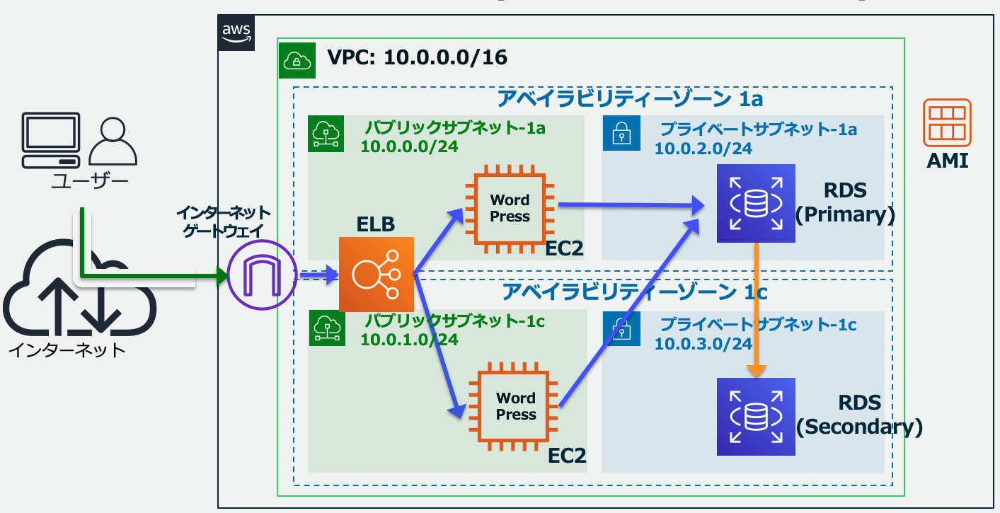

# Sample Code for cdk migrate

[スケーラブルウェブサイト構築 ハンズオン](https://catalog.us-east-1.prod.workshops.aws/workshops/47782ec0-8e8c-41e8-b873-9da91e822b36/ja-JP)の以下構成を作成する CloudFormation テンプレートファイル([/cfn/all-template.yaml](./cfn/all-template.yaml))を cdk に変換するデモです。



## 前提条件
上記したテンプレートファイルをデプロイするには事前に、ハンズオン手順内の AMI の作成により、AMI を作成する必要があります。
手順 「[5. WordPress の初期設定](https://catalog.us-east-1.prod.workshops.aws/workshops/47782ec0-8e8c-41e8-b873-9da91e822b36/ja-JP/hands-on/phase5)」までのリソースは CloudFormation テンプレート([/cfn/ec2-template.yaml](./cfn/ec2-template.yaml)) で実装できるため、事前に AMI のご準備をお願いします。


## スタックから作成する場合
```bash
cd ./cdk
cdk migrate --from-stack --stack-name scalable-handson-stack
```

## テンプレートファイルから作成する場合
```bash
cd ./cdk
cdk migrate --stack-name scalable-handson-stack-from-template --language typescript --from-path ../cfn/all-template.yaml 
```

